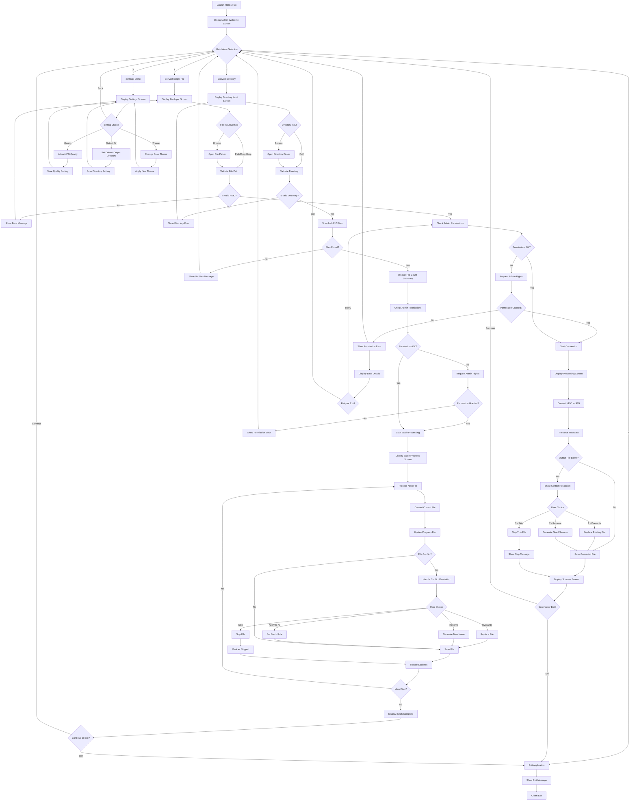

# HEIC-2-Go: AI Agent Development PRD
*Optimized for SWE-1 Agentic Coding in Windsurf IDE*

## 🎯 Executive Summary for AI Agent

**Project Type:** Cross-platform CLI utility with interactive ASCII interface  
**Primary Goal:** Convert HEIC files to JPG with zero quality loss and preserved metadata  
**Target Platforms:** Windows 11, macOS, Linux  
**Development Approach:** Full agentic coding using SWE-1 in Windsurf IDE  
**Expected LOC:** 800-1200 lines across 8-12 files  
**Complexity Level:** Moderate (single-purpose tool with rich UX)

---

## 🤖 AI Agent Instructions & Prompts

### Primary Development Prompt for SWE-1:
```
You are building HEIC-2-Go, a cross-platform CLI tool that converts iPhone HEIC photos to JPG format. 

CORE REQUIREMENTS:
- Interactive ASCII art terminal interface inspired by Claude Code/Gemini CLI
- Preserve all EXIF metadata and original image quality
- Handle single files and directory batch processing
- Cross-platform compatibility (Windows 11, macOS, Linux)
- Self-contained executable with no external dependencies
- Elegant error handling with admin permission requests

TECHNICAL STACK TO USE:
- Language: Go (for cross-compilation and performance)
- Image Processing: Go's built-in image libraries + github.com/rwcarlsen/goexif
- CLI Framework: github.com/spf13/cobra for commands + github.com/fatih/color for styling
- ASCII Art: github.com/common-nighthawk/go-figure for figlet text
- Cross-platform builds using Go's built-in cross-compilation

START WITH: Create project structure, then implement the ASCII art welcome screen exactly as specified in the UI mockups section.
```

### Secondary Iteration Prompts:
```
PROMPT 2: "Implement the core HEIC to JPG conversion engine with metadata preservation. Focus on quality and error handling."

PROMPT 3: "Add the interactive navigation system with card-like screens and progress bars exactly as shown in the UI specifications."

PROMPT 4: "Implement file conflict resolution with the three-option system (overwrite/rename/skip) as specified."

PROMPT 5: "Add cross-platform admin permission handling for Windows UAC, macOS sudo, and Linux sudo."

PROMPT 6: "Create the directory scanning and batch processing logic with colored progress indicators."

PROMPT 7: "Build the cross-platform executable compilation and create installation scripts."
```

---

## 🎨 UI Design Specifications (ASCII Art Interface)

### Welcome Screen (Exact Implementation Required):
```
╔══════════════════════════════════════════════════════════════════════╗
║                                                                      ║
║  ██╗  ██╗███████╗██╗ ██████╗    ██████╗        ██████╗  ██████╗     ║
║  ██║  ██║██╔════╝██║██╔════╝    ╚════██╗      ██╔════╝ ██╔═══██╗    ║
║  ███████║█████╗  ██║██║  ███╗    █████╔╝█████╗██║  ███╗██║   ██║    ║
║  ██╔══██║██╔══╝  ██║██║   ██║   ██╔═══╝ ╚════╝██║   ██║██║   ██║    ║
║  ██║  ██║███████╗██║╚██████╔╝   ███████╗      ╚██████╔╝╚██████╔╝    ║
║  ╚═╝  ╚═╝╚══════╝╚═╝ ╚═════╝    ╚══════╝       ╚═════╝  ╚═════╝     ║
║                                                                      ║
║                    Convert HEIC files to JPG                        ║
║                   Preserve quality • Keep metadata                   ║
║                                                                      ║
╚══════════════════════════════════════════════════════════════════════╝

Welcome! What would you like to do?

┌─────────────────────────────────────────────────────────────────────┐
│  [1] Convert single file                                            │
│  [2] Convert directory                                              │
│  [3] Settings                                                       │
│  [4] Exit                                                           │
└─────────────────────────────────────────────────────────────────────┘

Enter your choice (1-4): _
```

### Single File Selection Screen:
```
╔══════════════════════════════════════════════════════════════════════╗
║                            Convert Single File                       ║
╚══════════════════════════════════════════════════════════════════════╝

┌─────────────────────────────────────────────────────────────────────┐
│  📁 Enter file path or drag & drop:                                 │
│  ________________________________________________                    │
│                                                                     │
│  💡 Tip: You can also type 'browse' to open file picker            │
└─────────────────────────────────────────────────────────────────────┘

File path: _
```

### Processing Screen with Progress Bar:
```
╔══════════════════════════════════════════════════════════════════════╗
║                          Processing Files                            ║
╚══════════════════════════════════════════════════════════════════════╝

📂 Processing: /Users/photos/IMG_001.HEIC
📊 Progress: [████████████████████████████████████████] 100%

┌─────────────────────────────────────────────────────────────────────┐
│  ✅ Successfully converted IMG_001.HEIC → IMG_001.jpg               │
│  📏 Original: 3.2 MB → Converted: 2.8 MB                           │
│  🏷️  Metadata preserved: ✓ EXIF ✓ GPS ✓ Timestamp                 │
│                                                                     │
│  ⏱️  Time taken: 1.2 seconds                                        │
└─────────────────────────────────────────────────────────────────────┘

Press Enter to continue...
```

### File Conflict Resolution Screen:
```
╔══════════════════════════════════════════════════════════════════════╗
║                           File Conflict                              ║
╚══════════════════════════════════════════════════════════════════════╝

⚠️  The file "IMG_001.jpg" already exists!

┌─────────────────────────────────────────────────────────────────────┐
│  📄 Existing file: IMG_001.jpg                                      │
│  📅 Created: 2025-07-29 14:23:15                                    │
│  📏 Size: 2.1 MB                                                    │
│                                                                     │
│  🔄 New file: IMG_001.HEIC → IMG_001.jpg                           │
│  📏 Size: 2.8 MB                                                    │
└─────────────────────────────────────────────────────────────────────┘

What would you like to do?

┌─────────────────────────────────────────────────────────────────────┐
│  [1] 🔄 Overwrite existing file                                     │
│  [2] 📝 Rename new file (IMG_001_1.jpg)                            │
│  [3] ⏭️  Skip this file                                             │
└─────────────────────────────────────────────────────────────────────┘

Enter choice (1-3): _
```

### Batch Processing Screen:
```
╔══════════════════════════════════════════════════════════════════════╗
║                         Batch Processing                             ║
╚══════════════════════════════════════════════════════════════════════╝

📁 Directory: /Users/photos/vacation/
📊 Found 15 HEIC files (total: 47.3 MB)

┌─────────────────────────────────────────────────────────────────────┐
│  Overall Progress: [████████████████████████████████████████] 6/15   │
│                                                                     │
│  ✅ IMG_001.jpg ✅ IMG_002.jpg ✅ IMG_003.jpg                         │
│  ✅ IMG_004.jpg ✅ IMG_005.jpg ✅ IMG_006.jpg                         │
│  🔄 IMG_007.HEIC (converting...)                                    │
│  ⏳ IMG_008.HEIC (waiting...)                                        │
│  ⏳ ...8 more files                                                  │
│                                                                     │
│  📈 Success: 6  🚫 Failed: 0  ⏭️ Skipped: 0                        │
│  ⏱️  Elapsed: 0:08  📊 Speed: 2.1 files/sec                        │
└─────────────────────────────────────────────────────────────────────┘
```

---

## 🗺️ User Flow Diagram for AI Agent

The following Mermaid diagram maps the complete user journey through HEIC-2-Go. This visual guide helps AI agents understand decision points, error handling paths, and the overall application logic flow.



### Key Flow Insights for AI Implementation:
- **Permission Handling**: Critical checkpoint before any file operations
- **Error Recovery**: Multiple retry paths and graceful degradation
- **Batch Processing**: Efficient loop with conflict resolution options
- **State Management**: Clean navigation between all screens
- **User Choice Points**: Clear decision trees with defined outcomes

---

## 🛠️ Technical Implementation Guide for AI Agent

### Project Structure (Create exactly as specified):
```
heic-2-go/
├── cmd/
│   └── root.go           # Cobra CLI setup and main commands
├── internal/
│   ├── converter/
│   │   ├── heic.go       # Core HEIC to JPG conversion logic
│   │   └── metadata.go   # EXIF metadata preservation
│   ├── ui/
│   │   ├── screens.go    # ASCII art screens and navigation
│   │   ├── progress.go   # Progress bars and status display
│   │   └── colors.go     # Color scheme and styling
│   ├── files/
│   │   ├── scanner.go    # Directory scanning and file discovery
│   │   ├── conflict.go   # File conflict resolution logic
│   │   └── permissions.go # Cross-platform admin permission handling
│   └── config/
│       └── settings.go   # User preferences and configuration
├── pkg/
│   └── version/
│       └── version.go    # Version information and build details
├── scripts/
│   ├── build.sh          # Cross-platform build script
│   └── install.sh        # Installation script for users
├── go.mod                # Go module dependencies
├── go.sum                # Dependency checksums
├── main.go               # Application entry point
├── Makefile              # Build automation
├── README.md             # User documentation
└── .github/
    └── workflows/
        └── release.yml   # GitHub Actions for automated releases
```

### Required Dependencies (Add to go.mod):
```go
module github.com/yourusername/heic-2-go

go 1.21

require (
    github.com/spf13/cobra v1.7.0
    github.com/fatih/color v1.15.0
    github.com/common-nighthawk/go-figure v0.0.0-20210622060536-734e95fb86be
    github.com/rwcarlsen/goexif v0.0.0-20190401172101-9e8deecbddbd
    github.com/schollz/progressbar/v3 v3.13.1
    golang.org/x/sys v0.10.0
)
```

### Core Conversion Logic Specifications:
```go
// File: internal/converter/heic.go
type ConversionResult struct {
    OriginalPath  string
    ConvertedPath string
    OriginalSize  int64
    ConvertedSize int64
    ProcessingTime time.Duration
    MetadataPreserved bool
    Success       bool
    Error         error
}

// Key functions to implement:
func ConvertHEICToJPG(inputPath, outputPath string, quality int) (*ConversionResult, error)
func PreserveMetadata(originalPath, convertedPath string) error
func ValidateHEICFile(path string) bool
```

### UI Implementation Requirements:
- Use `github.com/fatih/color` for all colored output
- ASCII art generated with `github.com/common-nighthawk/go-figure`
- Progress bars using `github.com/schollz/progressbar/v3`
- All screens must clear terminal before displaying
- Implement smooth animations for progress indicators
- Color scheme: White (default), Green (success), Red (error), Blue (info), Yellow (warning)

### Cross-Platform Considerations:
- Windows: Use `golang.org/x/sys/windows` for UAC elevation
- macOS/Linux: Use `os/exec` to call `sudo` for permission elevation
- File path handling with `filepath` package for cross-platform compatibility
- Terminal size detection for responsive ASCII art sizing

---

## 📋 Development Tasks & Implementation Order

### Phase 1: Foundation (Files 1-3)
1. **Setup Project Structure**
   - Create directory structure exactly as specified
   - Initialize go.mod with required dependencies
   - Setup main.go entry point with version flag

2. **Implement ASCII UI Framework**
   - Create ui/screens.go with all screen templates
   - Implement navigation system between screens
   - Add color scheme and terminal clearing functions

3. **Build Basic CLI Commands**
   - Setup Cobra commands for convert, batch, and settings
   - Implement input validation and file path handling
   - Add help text and usage examples

### Phase 2: Core Conversion (Files 4-6)
4. **HEIC to JPG Conversion Engine**
   - Implement core conversion logic with quality preservation
   - Add HEIC file validation and format detection
   - Handle conversion errors gracefully

5. **Metadata Preservation**
   - Extract EXIF data from original HEIC files
   - Write metadata to converted JPG files
   - Validate metadata transfer success

6. **File Conflict Resolution**
   - Implement three-option conflict resolution system
   - Add file comparison and details display
   - Handle rename logic with incremental suffixes

### Phase 3: Batch Processing (Files 7-9)
7. **Directory Scanning**
   - Recursive/non-recursive directory traversal options
   - HEIC file discovery and filtering
   - File size calculation and pre-processing validation

8. **Progress Tracking System**
   - Real-time progress bars with percentage display
   - Success/failure counters and statistics
   - Processing speed calculation and time estimation

9. **Admin Permission Handling**
   - Windows UAC elevation requests
   - macOS/Linux sudo authentication
   - Graceful fallback for permission failures

### Phase 4: Polish & Distribution (Files 10-12)
10. **Settings and Configuration**
    - User preferences for default quality settings
    - Output directory configuration
    - Theme/color scheme selection

11. **Cross-Platform Building**
    - Automated build scripts for Windows, macOS, Linux
    - GitHub Actions workflow for releases
    - Installation scripts and documentation

12. **Testing and Error Handling**
    - Comprehensive error messages with solutions
    - Edge case handling (corrupted files, disk space, etc.)
    - Performance optimization and memory management

---

## 🎯 Success Criteria & Validation

### Functional Requirements Checklist:
- [ ] Converts HEIC to JPG with zero quality loss
- [ ] Preserves all EXIF metadata (GPS, timestamp, camera settings)
- [ ] Handles single files and batch directory processing
- [ ] Interactive ASCII art interface with navigation
- [ ] File conflict resolution with three options
- [ ] Cross-platform admin permission requests
- [ ] Real-time progress bars with colored status indicators
- [ ] Self-contained executable with no dependencies

### Performance Benchmarks:
- Conversion speed: ≤2 seconds per standard photo (3MB HEIC)
- Memory usage: ≤100MB peak during batch processing
- File size efficiency: JPG output 85-95% of original HEIC size
- Startup time: ≤1 second from command to first screen
- Batch processing: Handle 100+ files without memory leaks

### UX Quality Metrics:
- Interface responsiveness: All screens load instantly
- Error messages: Actionable guidance for 95% of error scenarios
- Navigation flow: Intuitive progression through all screens
- Visual consistency: ASCII art alignment perfect across terminal sizes
- Color accessibility: Readable on both dark and light terminal themes

---

## 🚀 Build & Distribution Strategy

### Cross-Platform Compilation Commands:
```bash
# Windows (64-bit)
GOOS=windows GOARCH=amd64 go build -o bin/heic-2-go-windows-amd64.exe

# macOS (Universal Binary)
GOOS=darwin GOARCH=amd64 go build -o bin/heic-2-go-darwin-amd64
GOOS=darwin GOARCH=arm64 go build -o bin/heic-2-go-darwin-arm64

# Linux (64-bit)
GOOS=linux GOARCH=amd64 go build -o bin/heic-2-go-linux-amd64
```

### GitHub Release Automation:
- Automated builds on tag push
- Pre-compiled binaries for all platforms
- SHA256 checksums for security verification
- Installation instructions for package managers

---

## 🔧 AI Agent Development Notes

### SWE-1 Optimization Tips:
1. **Use specific file paths** when referencing implementation details
2. **Implement incrementally** - complete each phase before moving to next
3. **Test frequently** - run builds after each major component
4. **Follow Go conventions** - proper package structure and naming
5. **Handle errors explicitly** - no silent failures, always provide user feedback

### Windsurf IDE Integration:
- Use Cascade for multi-file refactoring and cross-package changes
- Leverage terminal preview for testing ASCII art layouts
- Use built-in Go tools for formatting and dependency management
- Commit frequently with descriptive messages for project tracking

### Quality Assurance Checkpoints:
- After Phase 1: Verify ASCII art displays correctly on all platforms
- After Phase 2: Test conversion with various HEIC file types and sizes
- After Phase 3: Validate batch processing with 50+ file directories
- After Phase 4: Confirm cross-platform builds work on target systems

---

**Document Version:** 1.0 - AI Agent Optimized  
**Target Agent:** SWE-1 in Windsurf IDE  
**Expected Development Time:** 6-8 hours of focused agentic coding  
**Maintenance Level:** Low (stable, single-purpose utility)